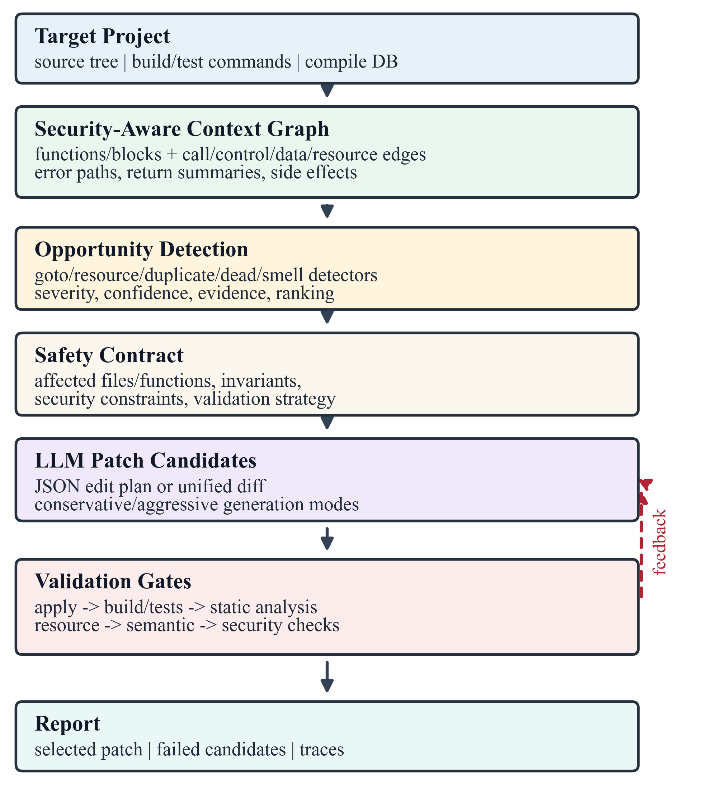
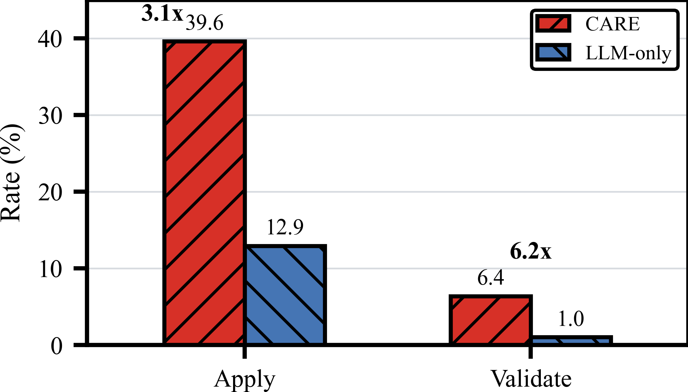
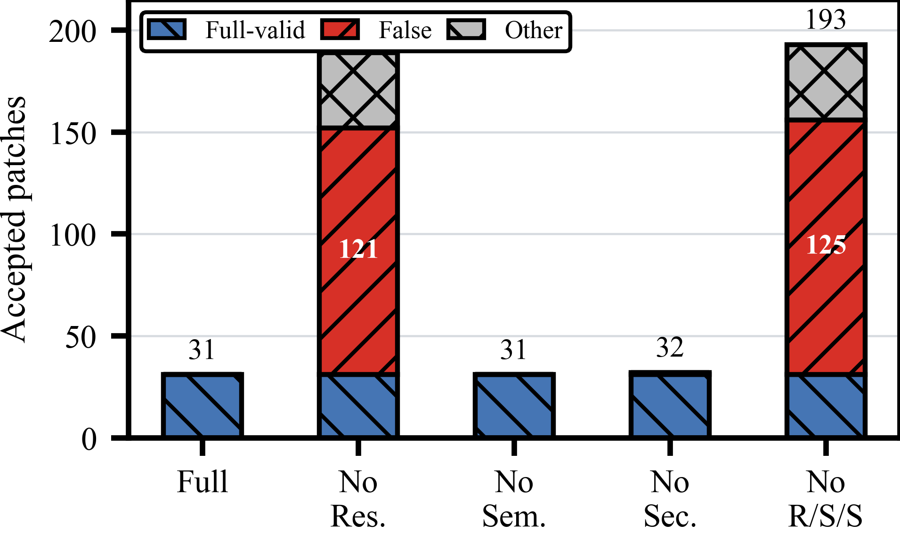

# CARE: Context-aware Automated Refactoring Engine

CARE is a Python research prototype for context-aware, security-preserving
refactoring of C/C++ projects. It combines lightweight program analysis, an
LLM-based patch proposal loop, and fail-closed correctness/security validation.



## Why CARE?

Traditional refactoring tools are often syntax-driven. Direct LLM patching can
produce plausible diffs, but it may miss C/C++ details such as cleanup order,
resource ownership, error codes, null/bounds checks, and API-visible side
effects. CARE treats the LLM as a proposal engine rather than an autonomous
developer: analysis constructs context, detectors rank opportunities, the LLM
generates small candidate patches, and validators reject unsafe edits.

CARE currently targets:

- goto-based cleanup and error-handling redundancy
- resource lifecycle imbalance such as missing/double free, close, or unlock
- repeated null, bounds, length, and status checks
- dead or unreachable code
- security smells such as unsafe APIs and unchecked return values

## Requirements

- Python 3.9+
- Git
- A C/C++ build toolchain for validating target projects
- Optional: `clang`, `clang-tidy`, `cppcheck`, and `scan-build`
- Optional for real patch generation: an OpenAI-compatible chat completions API

CARE runs in deterministic mock LLM mode by default, which is useful for tests
and local pipeline checks.

## Installation

```bash
python -m pip install --upgrade pip
python -m pip install -e .
```

For development:

```bash
python -m pip install -e ".[dev]"
pytest
```

## Quick Start

Run CARE on the included goto-cleanup example:

```bash
care run \
  --project examples/goto_refactor \
  --build-cmd "make" \
  --test-cmd "make test"
```

Run a duplicate-check example:

```bash
care run \
  --project examples/duplicate_check \
  --build-cmd "make" \
  --test-cmd "make test" \
  --max-opportunities 5 \
  --max-iters 3 \
  --mode conservative
```

Use a real OpenAI-compatible LLM:

```bash
export CARE_LLM_PROVIDER=openai
export CARE_LLM_MODEL=gpt-4.1
export CARE_LLM_API_KEY=...

care run \
  --project examples/duplicate_check \
  --build-cmd "make" \
  --test-cmd "make test" \
  --require-real-llm
```

You can also use the standard `OPENAI_API_KEY` environment variable. No API keys
are included or hard-coded in this repository.

## Output

CARE writes reports into the target project:

```text
care-report.json
care-report.md
patches/opportunity-001-candidate-001.diff
patches/opportunity-001-selected.diff
```

Reports include detected opportunities, selected patches, failed candidates,
validation logs, security impact summaries, performance impact estimates, and
traceability from each opportunity to its patch.

## Paper Artifacts

This repository includes the current paper draft sources and curated artifacts:

- `docs/paper/sections/`: LaTeX section drafts.
- `docs/paper/img/`: paper figures.
- `artifacts/figures/`: publication-ready figure copies.
- `artifacts/oss50/tables/`: evaluation tables in Markdown, CSV, JSON, and
  LaTeX form.
- `artifacts/oss50/selected-patches/`: 31 CARE patches that passed validation.
- `artifacts/openssl/top5-realval/`: a focused OpenSSL real-validation artifact.

The raw OSS50 source checkouts and multi-gigabyte raw reports are intentionally
excluded. They can be regenerated with the scripts in `scripts/`.

## Highlighted Results

CARE was evaluated on OSS50, a benchmark of 50 C/C++ open-source projects. The
dry scan completed on 49 projects, covering 25,162 source files and 266,602
functions, and detected 142,104 refactoring opportunities.

| Metric | CARE | LLM-only |
| --- | ---: | ---: |
| Critical opportunities | 487 | 487 |
| Applicable patches | 193 | 63 |
| Patch apply rate | 39.63% | 12.94% |
| Fully validated patches | 31 | 5 |
| Validation pass rate | 6.37% | 1.03% |

CARE improves patch applicability by 3.1x and full validation yield by 6.2x
over direct LLM-only patching under the same 487-call LLM budget.



Validator ablation shows why fail-closed checking matters. Removing the
resource checker would admit 158 additional CARE patches, but 121 of those are
classified as false accepts by the review pass.



## Benchmark Scripts

Useful scripts:

- `scripts/run_oss50_benchmark.py`: scan OSS50 projects.
- `scripts/run_oss50_llm_validation.py`: run real LLM patch generation and
  validation.
- `scripts/run_oss50_parallel_validation.py`: process-level parallel validation.
- `scripts/run_oss50_dynamic_validation.py`: dynamic remainder runner.
- `scripts/make_table1_care_vs_llm.py`: generate paper Table 1.
- `scripts/make_table2_validator_ablation.py`: generate validator ablation.
- `scripts/run_detector_precision_review.py`: LLM-assisted detector precision
  review.

## Repository Layout

```text
care/                 Python CARE prototype
examples/             Small C examples
tests/                Pytest suite
scripts/              Benchmark and artifact scripts
docs/paper/           LaTeX paper draft and figures
artifacts/            Curated public paper artifacts
benchmarks/           Lightweight benchmark config only
```

## Status

CARE is a research prototype. Passing validation is conservative evidence of
safety, not a formal proof of semantic equivalence. Maintainers should still
review accepted patches before upstreaming them.
